# 基于Capacitor+H5（Vue+Vite）的App开发经历

## 一、App开发模式

### 1.Native

`Native App`指原生APP，使用原生（即`Android`或`iOS`）开发的APP，`Android`基于`kotlin`语言和`Android Studio`工具进行开发，`iOs`基于`swift`语言和`X code`工具进行开发,显然需要开发`iOS`和`Android`两者，成本很大，需要同时开发两套系统。

### 2.WebApp 

`Web App`一般指的是基于 Web 的应用，基于**浏览器运行**，**无需下载安装**，基本上可以说是触屏版的网页应用。这类应用基本上是一个网页或一系列网页，旨在在移动屏幕上工作。开发和维护成本低，可以跨平台，但是性能低，用户体验差，功能受限较多。

### 3.Hybrid

`Hhybrid App`顾名思义就是原生 App 与 `Web App` 的结合。它的壳是原生 App，但是里面放的是`WebView`。 可以理解成，混合 App 里面隐藏了一个浏览器，用户看到的实际上是这个隐藏浏览器渲染出来的网页。支持跨平台，开发成本低。

现在比较流行的混合方案主要有三种，主要是在UI渲染机制上的不同：

1. 基于 **WebView UI** 的基础方案，市面上大部分主流 App 都有采用，例如`微信JS-SDK`、`Cordova`，`Capacitor`,通过` JSBridge` 完成` H5 `与 `Native` 的双向通讯，从而赋予H5一定程度的原生能力。
2. 基于 **Native UI** 的方案，例如 `React-Native`、`Weex`、`uniapp`。在赋予 H5 原生API能力的基础上，进一步通过` JSBridge` 将`js`解析成的虚拟节点树(Virtual DOM)传递到 Native 并使用原生渲染。

在此特别强调一下第三种方案——基于**小程序**方案，也是通过更加定制化的 `JSBridge`，并使用`双 WebView `双线程的模式隔离了`JS`逻辑与UI渲染，形成了特殊的开发模式，加强了` H5` 与` Native `混合程度，提高了页面性能及开发体验。

## 二、技术选型

基于对`App`开发的调研，以及团队的整体情况，最终确定了以`Hybrid`的形式进行`App`开发，基于时间成本的考虑，最终敲定了`H5`开发+`Capacitor`的形式。

## 三、关于Capacitor

- Capacitor 是Ionic 团队维护的项目，其官方团队和社区提供了很多 Capacitor 插件，旨在提供一些原生功能。

- Capacitor 需要结合Android Studio进行apk打包，如果你还需要打包iOS ipa 的话则也需要安装XCODE (过程可能会需要更新OSX 系统)

## 四、安装Android Studio

具体安装过程跳过

为了测试不同版本的`Android`，可以考虑将7~14 版本的`SDK`都装起来试试看！

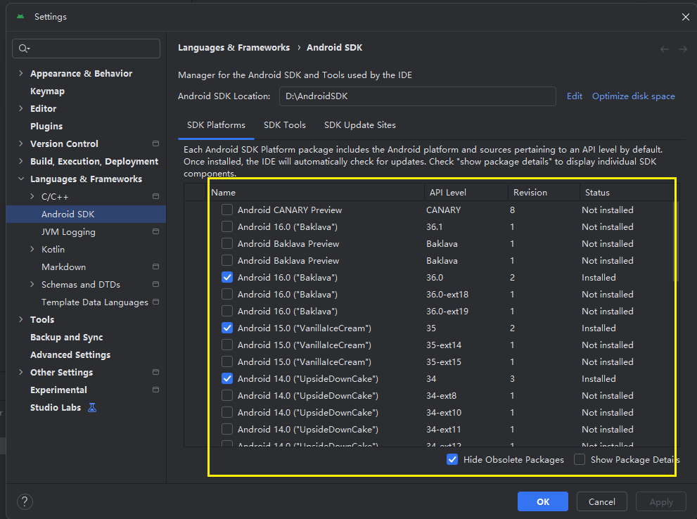

## 五、Capacitor 安装教学

#### 1.基础依赖

最好项目使用`npm`进行安装依赖

~~~~
npm install @capacitor/core  @capacitor/android @capacitor/ios
npm install @capacitor/cli @capacitor/assets -D
~~~~

项目使用具体版本

~~~~
    "@capacitor/android": "^4.1.0",
    "@capacitor/core": "^4.1.0",
    "@capacitor/ios": "^4.1.0",
    
    "@capacitor/assets": "^3.0.5",
    "@capacitor/cli": "^4.1.0",
~~~~

#### 2.初始化Capacitor配置文件

~~~~
npx cap init
~~~~

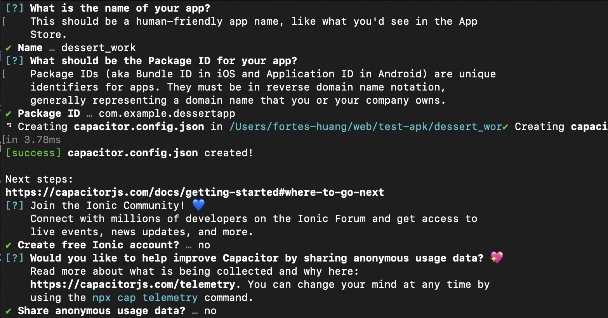

初始化的过程会询问你要如何命名这个app名称、以及反向域名格式的APP ID。
 例如：`com.example.frontapp`

然后会生成一个`capacitor.config.json`文件 ，这是`Capacitor`项目的核心配置文件，你可以在这里设置应用名称、ID、Web目录、原生权限等关键参数。

以下是一个典型的配置示例：

~~~~
{
  "appId": "com.example.frontapp",
  "appName": "APP名称",
  "webDir": "dist", 生产环境取打包后名叫dist的文件作为app底座
  "bundledWebRuntime": false,
  "server": {
    "url"：'http://xxxxx'  本地环境url
    "cleartext": true //允许http明文传输
  },
}

~~~~

如果是`typescript`项目使用`capacitor.config.ts`

以下是一个典型的配置示例：

~~~~
import { CapacitorConfig } from '@capacitor/cli';
 
const config: CapacitorConfig = {
  appId: 'com.example.myapp',
  appName: 'My Capacitor App',
  webDir: 'dist', // Web构建产物目录
  bundledWebRuntime: false,
  server: {
    url: 'http://192.168.1.100:8100', // 开发服务器地址
    cleartext: true // 允许明文传输（开发环境）
  },
  ios: {
    contentInset: 'always' // 刘海屏 状态栏  底部 Home Indicator WebView 默认会给内容加 inset（内边距） 
    // scrollableAxes只在可滚动方向适配 
    // never 不处理
  },
  android: {
    allowMixedContent: true, // HTTPS 页面里能不能加载 HTTP 资源 ,生产用 HTTPS + 关掉 mixed content
    webContentsDebuggingEnabled: true // 可以用 Chrome DevTools 调试 Android WebView   chrome://inspect
  }
};
 
export default config;
~~~~

关键配置项说明：

- `webDir`：指定Web应用构建后的文件目录，通常是`dist`、`build`或`public`
- `server`：配置开发服务器，用于实时重载和调试
- `ios/android`：平台特定配置，如权限、界面行为等
- 当`server`存在`url`的时候，默认安卓会走指向`url`的开发环境，而不是走`dist`构建后的产物

#### 3.打包vite项目

~~~
npm run build
~~~

打包后的包名需要和capacitor配置文件中的`webDir`对应

~~~~
pnpm cap add android # 会在vite项目根目录生成一个android 目录(保证已经打包构建出了 dist 目录)
~~~~

请提前配置好安卓环境，安装好 SDK

~~~~
pnpm cap open android ## 打开Android Studio后，第一次加载有点慢（点击build查看进度）
~~~~

- 等待打开`Android Studio`后后，点击 `Android Studio `右上角的 `Sync Project with Gradle Files`按钮，如果出现`Gradle `和`Gradle jdk`版本不兼容，需要到`Android Studio` - `setting`下进行配置

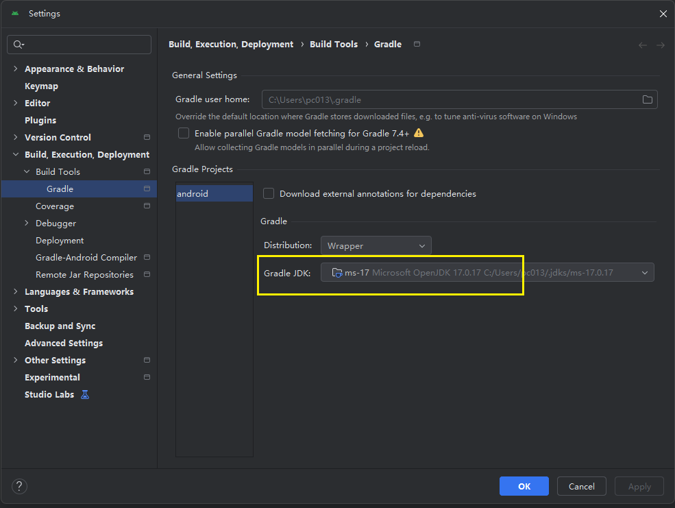

- 添加设备

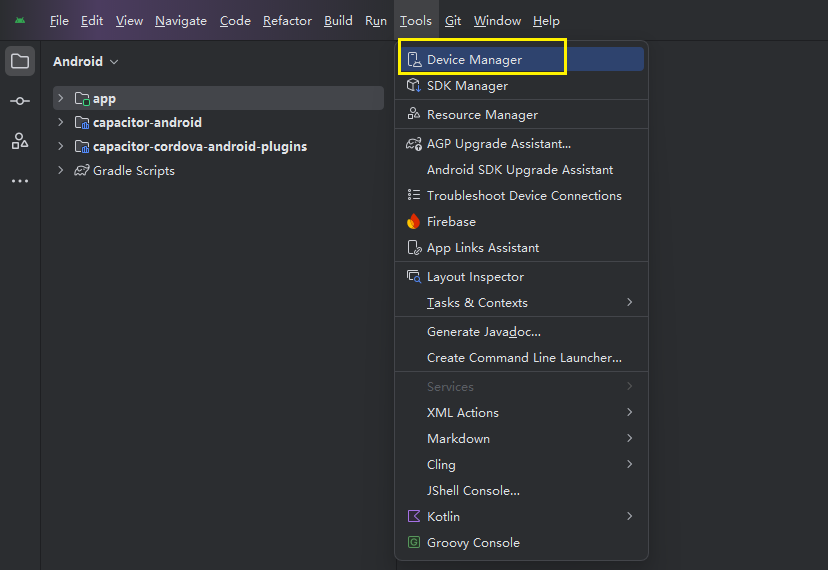

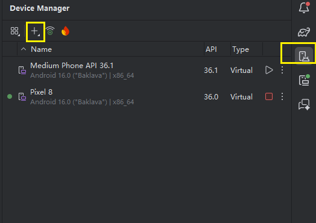

- 点击右上角的 Run 

#### 4.开发工作流

- 如果是本地环境

我们需要在`capacitor.config.json`中，加上`server`的`url`，当加上此`url`，执行`npx cap sync`同步配置到`android`中

~~~~
{
  "appId": "app.flyshare.h5",
  "appName": "飞享家",
  "webDir": "dist",
  "bundledWebRuntime": false,
  "server": {
    "url": "http://本地环境地址",
    "cleartext": true
  }
}

~~~~

- 如果是线上环境，则需要去掉`url`配置，让`android`指向`dist`构建后的产物

~~~~
{
  "appId": "app.flyshare.h5",
  "appName": "飞享家",
  "webDir": "dist",
  "bundledWebRuntime": false,
}
~~~~

- 如果线上环境希望只是给H5套一个壳，并且后端是http请求，可以类似`wap2app`处理方式，给H5套壳然后url指向项目线上地址。

~~~~
{
  "appId": "app.flyshare.h5",
  "appName": "飞享家",
  "webDir": "dist",
  "bundledWebRuntime": false,
  "server": {
      "url": "http://线上环境地址",
    "cleartext": true//允许http明文传输
  }
}
~~~~

#### 5.启动画面和App图标

[可以使用@capacitor/assets](https://github.com/ionic-team/capacitor-assets)工具为您的` iOS`、`Android `或渐进式 Web 应用程序生成启动画面和图标。

使用以下文件夹/文件名结构提供图标和启动画面源图像：

~~~~
assets/
├── icon-only.png
├── icon-foreground.png
├── icon-background.png
├── splash.png
└── splash-dark.png
~~~~

- 图标文件大小至少应为`1024px`x `1024px`。
- 启动画面文件大小至少应为`2732px`x `2732px`。
- 格式可以是`jpg`或`png`。

然后生成（适用于您的原生项目或生成 PWA 清单文件）：

~~~~
npx capacitor-assets generate
~~~~

**注意：如果此处如果出现sharp报错,请使用npm安装@capacitor/assets 依赖，并且安装sharp到项目或者全局**

~~~~
npm install  --include=optional sharp
~~~~

or

~~~~
npm install -g --include=optional sharp
~~~~

#### 6.打包apk

- 选取`Android Studio`的`Build -> Build Bundle(s ) / APK(s) -> Build APK(s)`

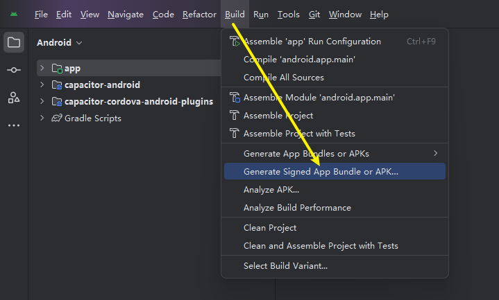

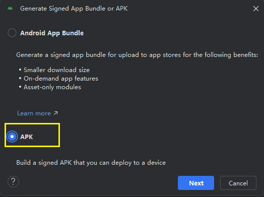

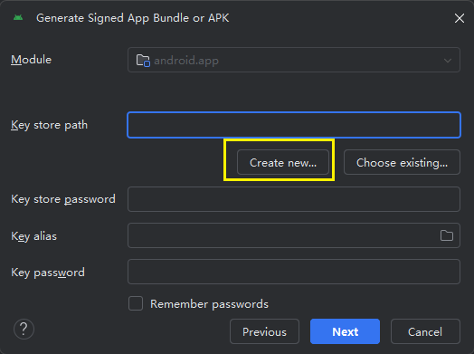

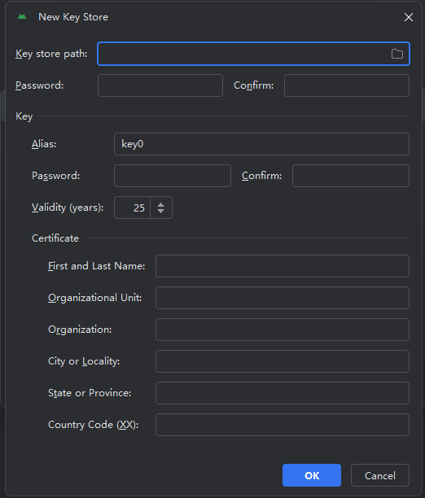

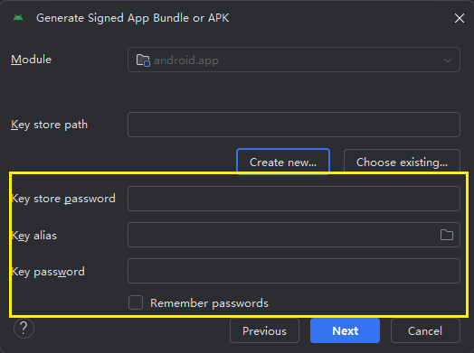

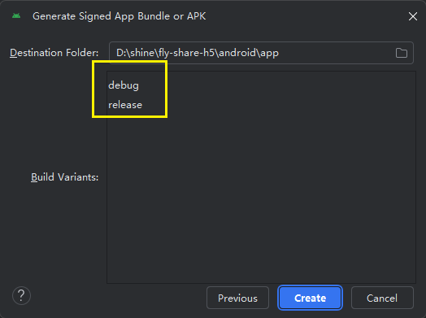

## 六、理解Capacitor

~~~~
pnpm cap add android
~~~~

- 创建 `android/` 原生工程
- 把 `dist/` 拷贝进 Android
- 建立 WebView 壳
- 不会自动监听你后续的前端变化
- 全局执行一次即可，后续如果web有更新，配合`npx cap sync`更新即可

~~~~
npx cap sync
~~~~

- 同步web端的更新、capator.config配置更新 到`android`或`iOs`

